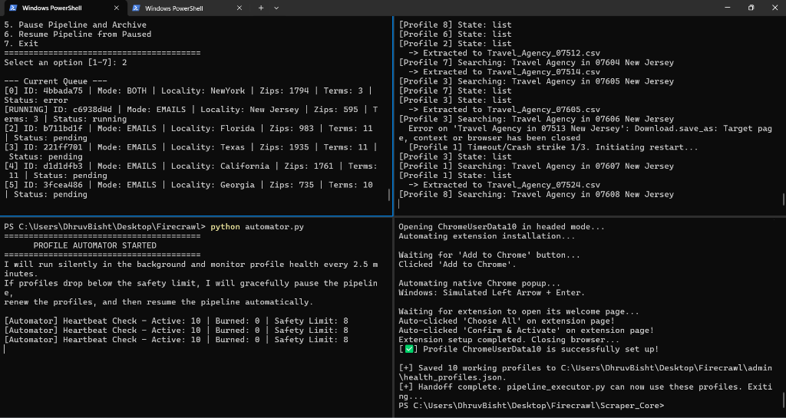

# Firecrawl Pipeline Manager

## ?? Latest Version Updates
This update introduces robust auto-recovery, advanced email formatting, intelligent self-healing profile systems, and built-in campaign tools:

### Added Functionalities:
- **Built-in Campaign Date Changer**: change_campaign_date.bat is now seamlessly integrated into the pipeline. segment_formatter.py automatically copies the script into the uploadable_csvs directory upon completion, allowing users to safely update dates on their finalized CSVs locally without losing the script.
- **Auto-Resume Interrupted Tasks**: pipeline_executor.py has been upgraded to automatically detect and resume tasks that were abruptly interrupted (e.g., due to a sudden power cut). It intelligently scans your working directory to validate completed pipeline stages and seamlessly picks up where it left off.
- **Dual-Stage Email Segmentation**: main.py now prompts for an *Initial Wording* segment (e.g. groupbookings_). The newly added segment_formatter.py script automatically runs at the end of the pipeline, performing rigorous email deduplication/cleaning to output raw emails to pre_segment_csvs/, and then builds the precise uploadable format with structured IDs directly into uploadable_csvs/.
- **Self-Healing Profile Automator**: utomator.py has been completely rewritten into an active background watchdog. It polls your health_profiles.json every 2.5 minutes, calculates profile burns against your safety limits, gracefully pauses the pipeline if needed, regenerates fresh profiles under the hood, and instantly resumes the pipeline-creating a flawless infinite loop!

### Removed / Legacy Functionalities:
- **Self-Deleting Date Script**: Removed the self-deletion mechanism from change_campaign_date.bat to allow it to persist inside the payload folders for permanent re-use.
- **Repository Cleanup**: The IITBHU_Wifi_Watchdog module was completely untracked from Git and added to .gitignore, preventing unnecessary bloat in the repository.
---

Welcome to the Firecrawl Pipeline Manager! This tool automates the process of finding local business leads via Google Maps, scraping their websites for emails, and extracting their phone numbers.

## ?? How to Set Up the Project on Your Computer

1. **Install Python**: Ensure you have Python 3.8+ installed on your system.
2. **Clone the Repository**: Download or clone this repository to your local machine.
3. **Install Requirements**: Install the required Python libraries. You can refer to 
equirements.md for a complete list. Run the following command in your terminal:
   `ash
   pip install pandas playwright beautifulsoup4 requests
   `
4. **Install Playwright Browsers**: After installing the Python packages, you must install the Playwright browser binaries:
   `ash
   playwright install chromium
   `

## ?? The Preferred Execution Flow & Terminal Layout

To ensure maximum efficiency and visibility, the system is designed to be run across 4 split terminals simultaneously. 

### Recommended Visual Layout

*This is exactly how it must look when running successfully.*

- **Top Left Terminal (main.py)**: The central hub for creating, managing, and viewing tasks in the queue. 
- **Top Right Terminal (pipeline_executor.py)**: The heavy lifter. It sequentially executes the tasks from the queue (Google Maps scraper, Aggregator, Cleaner, and Segment Formatter).
- **Bottom Left Terminal (utomator.py)**: The self-healing watchdog. It silently monitors your active profiles every 2.5 minutes and triggers recovery if profiles burn out.
- **Bottom Right Terminal (profile_manager.py)**: The profile generator. It creates and provisions Google Chrome profiles with extensions configured to evade Google's anti-bot protections.

### Step-by-Step Execution Flow
For the very first time you use the tool, or every time you relaunch all the processes for a new scraping session, follow this exact sequence:

1. **Create the Profiles First (Bottom Right Terminal)**
   Open the bottom right terminal, navigate into scraper_core, and create your initial batch of healthy profiles:
   `ash
   cd scraper_core
   python profile_manager.py
   `
   *Follow the prompts to configure your desired profile count and safety limits.*

2. **Create the Task (Top Left Terminal)**
   Open the top left terminal and run the interactive scheduler to generate a scraping task:
   `ash
   python main.py
   `
   *Follow the prompts to add your search terms, locality, initial wording, and zips. The task will sit in "Pending" status.*

3. **Start the Watchdog (Bottom Left Terminal)**
   Open the bottom left terminal and let the watchdog sit silently in the background:
   `ash
   python automator.py
   `

4. **Start the Executor (Top Right Terminal)**
   Finally, open the top right terminal to unleash the pipeline. It will immediately pick up the pending task and begin scraping using the profiles you just created!
   `ash
   python pipeline_executor.py
   `

---

## ?? Core Scripts Reference

### main.py
**Job:** Interactive Task Scheduler & Pipeline Manager.
- Adds new tasks with deep configurations (Initial Wording, Mode).
- Views the live queue and reorganizes priorities.
- Features global pipeline pausing and resuming for manual archiving.

### pipeline_executor.py
**Job:** The core pipeline engine.
- Pulls tasks from the queue.
- Executes lead.py, ggregate.py, cleaner.py, and segment_formatter.py sequentially.
- Automatically captures execution start times to ensure perfectly named output files (e.g. Search_Locality_Date_Time.csv).

### utomator.py
**Job:** Self-Healing Watchdog.
- Monitors dmin/health_profiles.json every 2.5 minutes.
- If profiles drop below the safety threshold, it safely commands the executor to pause (PAUSE_AND_WAIT).
- Automatically triggers profile_manager.py to restore lost profiles, then unpauses the executor.

### scraper_core/profile_manager.py
**Job:** Chrome Profile Provisioning.
- Generates authenticated Google Chrome profiles for Playwright.
- Can be run manually for setup, or automatically under-the-hood by utomator.py to replenish burnt profiles mid-scrape.

## ?? Best Practices & Recommendations

### Handling Chrome Profile Corruption (6-Hour Refresh Cycle)
Over long scraping sessions, Chrome profiles can sometimes become corrupted or consume excessive memory. To ensure the highest success rate, we recommend a **6-Hour Refresh Cycle**:

1. **Pause Pipeline and Archive (main.py -> Option 5):** Safely halts the current task and archives all progress without data loss.
2. **Recreate Profiles:** Run python scraper_core/profile_manager.py manually to wipe corrupted ChromeUserData folders and provision fresh ones.
3. **Resume Pipeline (main.py -> Option 6):** Unpause the system.
4. **Restart Executor:** Run python pipeline_executor.py. The executor will seamlessly resume the scrape with the new profiles exactly where it left off!

